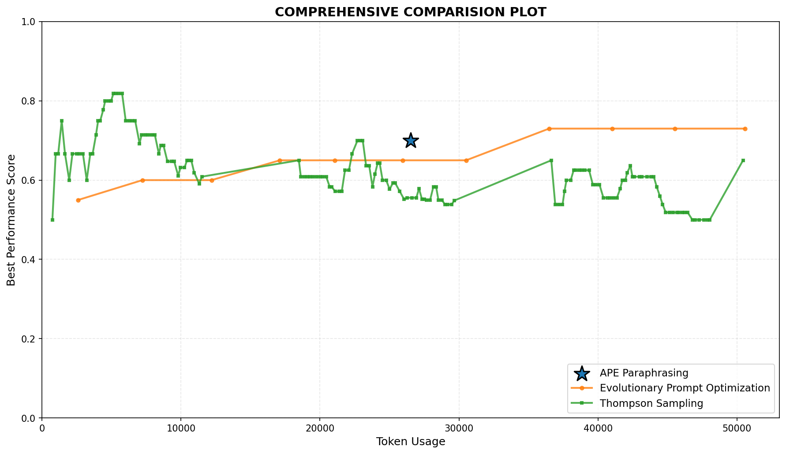
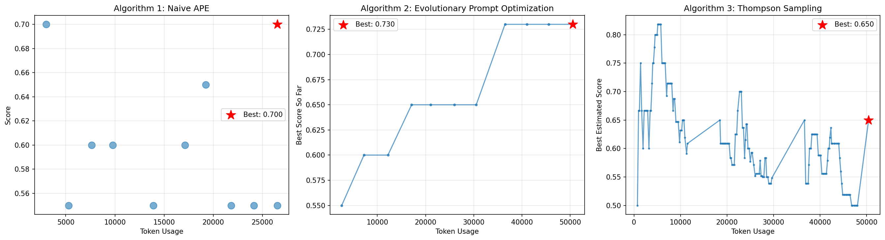

# Prompt Optimization

A comparative LLM evaluation project focused on **automated prompt optimization** for multi-step math reasoning tasks.

Instead of treating prompting as trial-and-error, this repository approaches it as a measurable optimization problem: how can we improve prompt quality under a constrained token budget?

## Problem this project solves

In practical LLM systems, prompt quality directly affects:

- answer correctness
- inference cost
- consistency across tasks
- reliability in production workflows

Manual prompt tuning is slow and hard to evaluate rigorously. This project explores how prompt improvement can be automated and compared systematically.

## What this project does

The repository evaluates multiple prompt-optimization strategies on GSM8K-style reasoning tasks under a shared token budget.

The compared approaches are:

- Naive APE-style optimization
- Evolutionary prompt optimization
- Thompson Sampling

## Research goal

The goal is to improve prompt performance while tracking:

- answer correctness
- optimization efficiency
- token usage
- relative tradeoffs between search strategies

## Visual results

| Algorithm Comparison | Individual Algorithm Behavior |
| --- | --- |
|  |  |

## Repository contents

- `Prompt_Optimization.ipynb`: main notebook with implementation and evaluation
- `comparison_plot.png`: comparative visualization
- `individual_algorithms.png`: algorithm-specific plot
- `requirements.txt`: Python dependencies

## Why this project matters

- It frames prompt engineering as an optimization workflow, not just experimentation.
- It compares multiple strategies under a controlled budget.
- It is useful for understanding how to make LLM pipelines more cost-aware and reproducible.
- It fits well into research, evaluation, and applied LLM systems work.

## Method summary

The notebook workflow includes:

1. defining a base reasoning prompt
2. evaluating prompts on math problems
3. tracking token consumption
4. optimizing prompts with three search strategies
5. comparing the final results and tradeoffs

## Run locally

```bash
pip install -r requirements.txt
```

Then open:

```text
Prompt_Optimization.ipynb
```

Configure your API key securely before running the experiment cells.

## Industrial positioning

A production-grade prompt-optimization system would typically add:

- benchmark versioning
- experiment tracking
- model-specific prompt registries
- cost and latency dashboards
- multi-task evaluation beyond GSM8K
- approval workflows before prompt rollout

This means the repo is best positioned as an **LLM evaluation and prompt-search research project** with practical relevance to applied AI systems.
